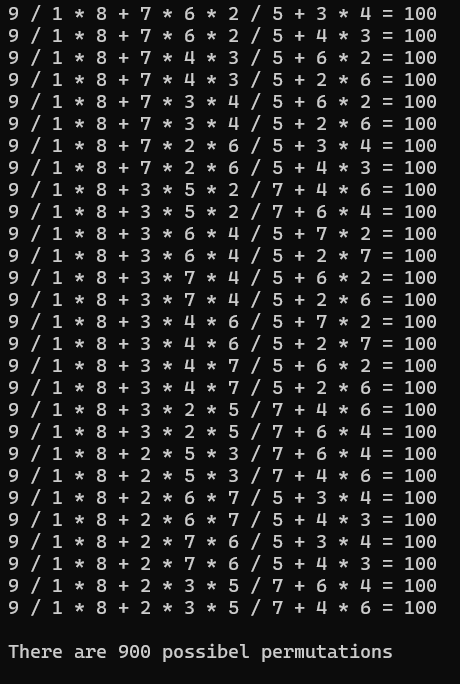

[Back to Portfolio](../index.md)

Math Permutations
===============

-   **Class: CSCI 415 - Algorithms** 
-   **Grade: 100/100** 
-   **Language(s): C++** 
-   **Source Code Repository:** [features/mastering-markdown](https://guides.github.com/features/mastering-markdown/)  
    (Please [email me](mailto:JRAndraszek@csustudent.net?subject=GitHub%20Access) to request access.)

## Project description

This project will output all permutations or possabilites of using 1, 2, 3, 4, 5, 6,7, 8, and 9 one time to fullfil the function:

```
a / b * c + d * e * f / g + h * i = 100
1 / 2 * 8 + 4 * 5 * 7 / 3 + 6 * 9 = 100
```

## How to compile and run the program

To run and compile this program, there is no user input or additional user requirements. So, you just run the following commands:

```bash
g++ -Wextra -Wall Permutations.cpp -o math.out
./math.out
```

## UI Design

In this program it outputs all unique solutions to the problem on their own lines.


Fig 1. Running of the code

## 3. Additional Considerations

This code can be altered or changed for a different math problem or altering the size of the vector. This would require an adjustment of the code. There are comments that show where it should be altered and how.

[Back to Portfolio](../index.md)