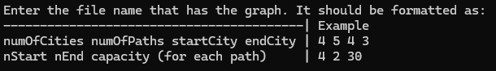
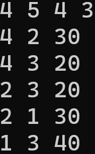
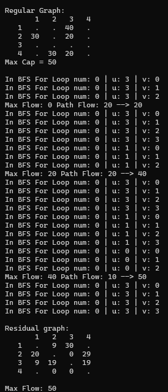
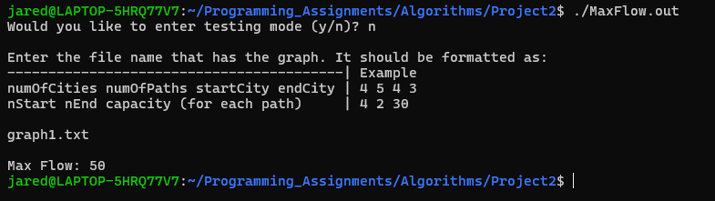

[Back to Portfolio](../index.md)

Max Flow Graphs
===============

-   **Class: CSCI 415 Algorithms** 
-   **Grade: 100/100** 
-   **Language(s): C++** 
-   **Source Code Repository:** [CSCI 415 - Algorithms](https://github.com/JaredAndraszek42/CSCI-415-Algorithms/tree/main/Project2)  
    (Please [email me](mailto:JRAndraszek@csustudent.net?subject=GitHub%20Access) to request access.)

## Project description

We can imagine this program by using a cities and roads analogy. Imagine there is a start city and an end city where vehicles want to travel from, but the roads can only hold 40, 30, and 30 vehicles at a time. So, they split up and go to other cities and take other roads to end at the end city without overfilling the roads. 

This program takes a graph in a file and outputs the max flow using the Ford Fulkerson Max Flow Algorithm. A graph consists of nodes and vertices that lead from one node to another. For this program, they are not bi-directional verticies. So node 4 flows to node 3, but node 3 does not flow to node 4. This program uses a custom data structure that contains a 2D vector and an adjacency matrix with weights that represents how much of a unit a path can carry.

## How to compile and run the program

To compile and run this program, you run the following code:

```
g++ -Wextra -Wall MaxFlowGraph.cpp -o MaxFlow.out
./MaxFlow.out
```

However, you will need a file with the graph following the set instructions (see fig. 1).


Fig1. Instructions to use for the graph file and an example graph.

After you have your file ready, the program asks for the filename and then continues the program.

## UI Design

For this program, there are two options available for UI, there is the default version and the testing version. At the beggining of the program, it will ask if you'd like to enter testing mode. This is available to see the behind the scenes and look at what paths the program tested (see fig. 2). If you only want to see the result, you do not have to enter testing mode (see fig. 3). 

  
Fig 2. Testing output

  
Fig 3. Default output

[Back to Portfolio](../index.md)