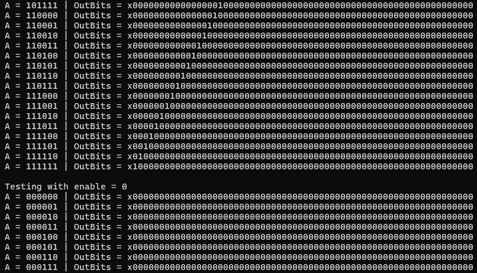

[Back to Portfolio](../index.md)

6x64 Bit Decoder
===============

-   **Class: CSCI 330 - Computer Architecture** 
-   **Grade: 87** 
-   **Language(s): verilog** 
-   **Source Code Repository:** [features/mastering-markdown](https://guides.github.com/features/mastering-markdown/)  
    (Please [email me](mailto:JRAndraszek@csustudent.net?subject=GitHub%20Access) to request access.)

## Project description

In this project, I created a 6x64 bit decoder. So it takes a 6 bit input like "001011" and converts it into a 64 bit output where the 11th bit (001011 in binary equals 11 in decimal) is 1 and the rest are 0. We do this by taking the three most signifigant bits, and using a 3x8 decoder. That 3x8 decoder's output will then be the enable input for 8 more 3x8 decoders. However, instead of using the 3 most significant bits as input, but the 3 least signifigant bits. A logical diagram of the structure is shown in figure 1, and the code can be seen in figure 2.


Fig 1. Logical diagaram of a 6x64 Decoder

  
Fig 2. Code of the decoder

## How to compile and run the program

To compile and run the code you need to run the following commands:

```bash
iverilog decoder_3x8.v decoder_6x64.v decoder_6x64_test.v -o decoder_6x64.out
./decoder_6x64.out
```

## UI Design

This program has no user input, just test cases. So, the output displays a test for all possible inputs. So 64 tests from 000000 to 111111 with both the enable wire on and off as shown in figure 3.

  
Fig 3. Some of the results of the test cases

[Back to Portfolio](../index.md)