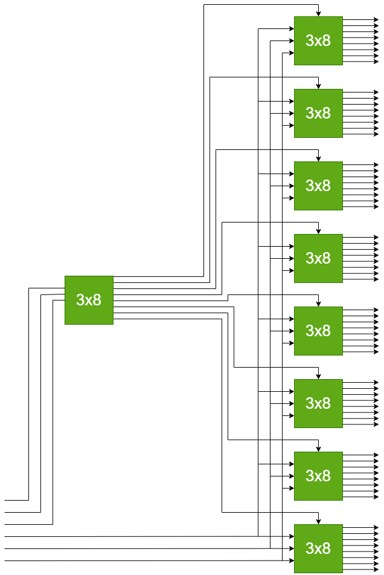

Portfolio
=========

Programming Projects
--------------------

*For access to my private project repositories, please [email me](mailto:JRAndraszek@csustudent.net?subject=GitHub%20Access) with the subject line, GitHub Access.

---
### [HTML Parser | CSCI 315](./Project-Pages/HTML-Parser.md)

---
### [Math Permutations | CSCI 415](./Project-Pages/Math-Permutations.md)

---
### [Max Flow Calculator | CSCI 325](./Project-Pages/Max-Flow.md)

---
### [6x64 Bit Decoder | CSCI 330](./Project-Pages/project4.md)

---

Ethics Papers
-------------

### [The Paradox of Privacy and Anonymity](https://github.com/JaredAndraszek42/csci-portfolio/blob/master/Ethics%20Papers/The%20Paradox%20of%20Privacy%20and%20Anonymity%20Ethics%20Paper.pdf)

-   **Class: CSCI 415 - Algorithms**  
-   **Grade: 100**

### [Software Testing and Certifications - A Biblical and Ethical Look](https://github.com/JaredAndraszek42/csci-portfolio/blob/master/Ethics%20Papers/Software%20Testing%20and%20Certifications%20-%20A%20Biblical%20and%20Ethical%20Look.pdf)

-   **Class: CSCI 315 - Data Structures Analysis**  
-   **Grade: 100**  

### [Engaging VS Distracting](https://github.com/JaredAndraszek42/csci-portfolio/blob/master/Ethics%20Papers/Engaging%20VS%20Distracting%20-%20Ethic%20Paper.pdf)

- **Class: CSCI 235 - Object Oriented Programming**
- **Grade: 100**

---

Presentations
-------------

### [Cloud Storage Vulnerabilites](/Presentations/Cloud%20Storage%20Vulnerabilites.pptx)

- **Class: CSCI 405 - Principles of Cyber Security**
- **Grade: 100**

### [First American Financial Data Leak](/Presentations/First%20American%20Financial%20Data%20Leak.pptx)

- **Class: CSCI 419 - Database Management**
- **Grade: 100**

---

Page template forked from <a href="https://github.com/csu-cs/csci-portfolio">CSU-CS</a>

<!-- Remove above link if you don't want to attributive -->