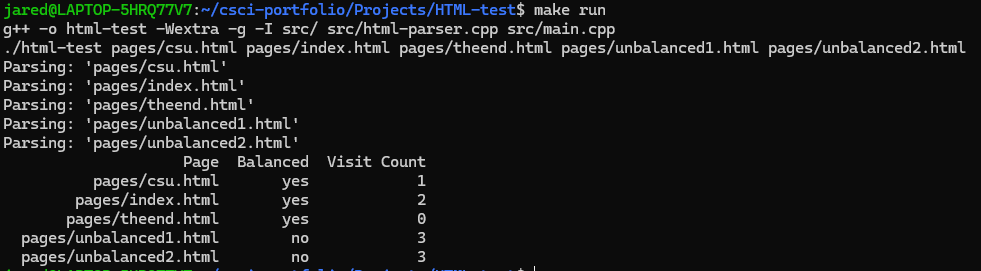
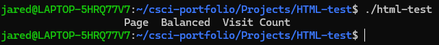
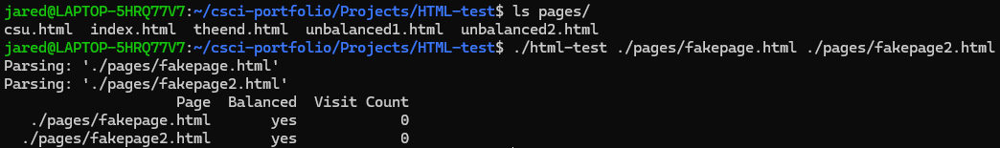

[Back to Portfolio](./)

HTML Parser
===============

-   **Class: CSCI 315 - Data Structures** 
-   **Grade: 80/100** 
-   **Language(s): C++** 
-   **Source Code Repository:** [features/mastering-markdown](https://guides.github.com/features/mastering-markdown/)  
    (Please [email me](mailto:JRAndraszek@csustudent.net?subject=GitHub%20Access) to request access.)

## Project description

This program determines if an HTML page has balanced HTML tags and can determine how many webpages you can visit from a certain HTML page. The program determines the HTML tags by the "<" and ">" characters. So an opening tag would be ```<html>``` and a closing tag would be ```</html>``` with the "/" character after the opening character. After determining if the webpage is balanced, the program will then determine how many redirects and other pages the website can access. So, if page1.html can access page2.html and page2.html can access page3.html, then from page1, there are 2 possible webpages it can access. There is also a check in place to ensure that no website is counted twice.

This HTML-parser uses a stack for each page that collects the HTML tags and a vector of visited pages. The program uses the stack to determine if the webpage is balanced. If the current tag is an opening tag, then add it to the stack. If the current tag is a close tag, then it checks the top tag and if they match, then the top tag is popped off the stack. If the stack is empty at the end of the webpage, then it is balanced. The program also uses a separate stack and vector to get the number of other webpages it can visit. After all webpages are checked, it will terminate the program.

## How to compile and run the program

There are two methods to run this program. The first is to use the make file, and the second is to run the pages individually.

```bash
cd ./HTML_parser
make run
```
This code will compile the program and test every webpage in the pages subfolder. 

```bash
cd ./HTML_parser
make
./html-test ./pages/csu.html ./pages/unbalanced2.html
```
This code will compile the program and only test these two webpages. You can run the program with as many arguments as you'd like or with GREP characters and it will test those webpages.

## UI Design

<!-- Almost every program requires user interaction, even command-line programs. Include in this section the tasks the user can complete and what the program does. You don't need to include how it works here; that information may go in the project description or in an additional section, depending on its significance. -->

This program is a command-line program that outputs the webpages it parses as to show the user what files the program is checking. This is especially useful when using the makefile or testing all of the files in a folder (see fig. 1). Afterwards, it displays the header, and then the information about a specific page. However, when no files are checked (see fig. 2), it will only display the header. This way, it shows that no files were tested and the application ran successfully. However, if the program runs pages that do not exist, (see fig. 3), the program treats them as a file and will test them. However, the files will not open and thus, end that search early and return a visit count of 0. The program's default value for balanced is true, because the program checks to see if the HTML tag stack is empty, and since there were no HTML tags to check, it is empty and returns true.


Fig 1. Running the program using the command make run

  
Fig 2. Running the program with no arguments

  
Fig 3. Running the program with html pages that do not exist

## 3. Additional Considerations

I recieved the initial starting code from Dr. Hayes. This starter code consisted of the main and trim functions in main.cpp and the function headers we should use for the initial three functions in html-parser.hpp.

[Back to Portfolio](./index.md)